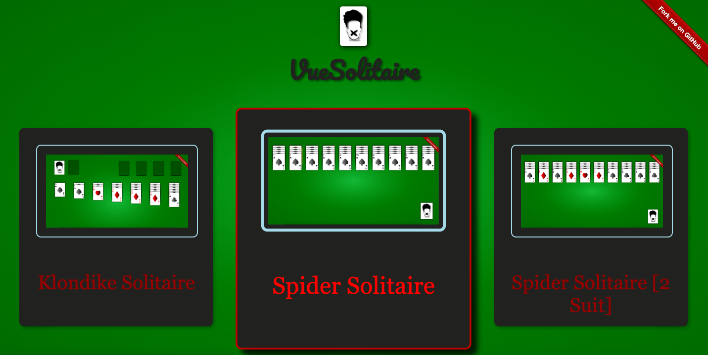
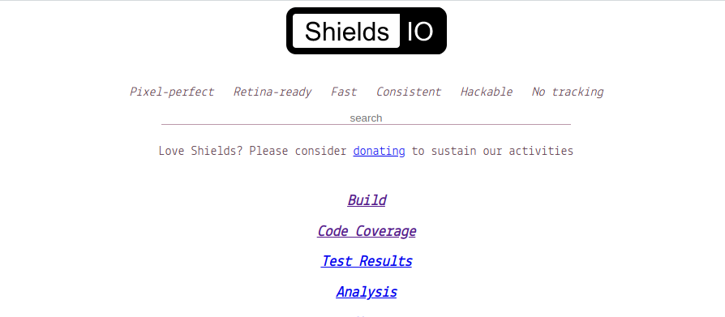
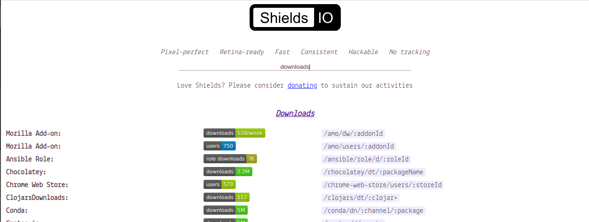
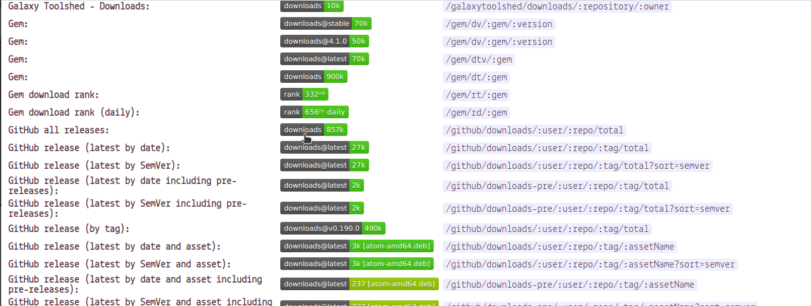
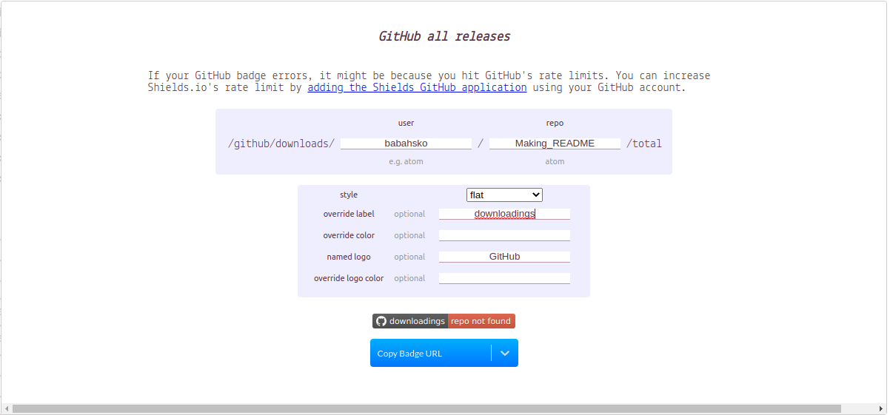
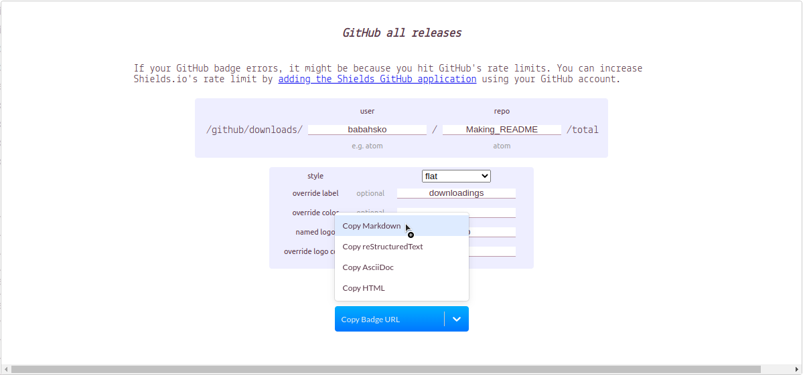

# Making_README


## Что это?
Этот документ содержит краткие фичи для создания хорошего README файла и предназначен для начинающих разработчиков.

Для проекта надо подготовить хорошее описание. При составлении описания можно придерживаться такого плана:

- название (желательно и его изображение тоже);
- описание (с использованием слов и изображений);
- демо (изображения, ссылки на видео, интерактивные демо-ссылки);
- технологии в проекте;
- что-то характерное для проекта (проблемы, с которыми пришлось столкнуться, уникальные составляющие проекта);
- техническое описание проекта (установка, настройка, как помочь проекту).

Используемый здесь проект будем считать за образец. У него один из красивейших файлов readme, который мне приходилось видеть. Код файла Readme.md можно найти здесь:silent-lad/VueSolitaire

## 1. Добавляем картинки
У вас может быть отличная фотографическая память, но интересующимся вашим проектом могут понадобиться фотографии его демо-версии.

Так, в описание нашего образцового проекта «Паук» в readme добавлены такие изображения:
<p align="center">
</p>
Чтобы добавить изображение используйте следующий синтаксис:

- ``

Но часто возникает необходимость центрировать картинку или изменить её размер. Для этого в файла Markdown поддерживается язык html разметки.
Перепишем верхнюю ссылку на картинку в формате html разметки.
- `<p align="center">`
- ``
- `</p>`

Но я столкнулся с проблемой, что при использовании ссылки на картинку она не центрируется. Решил я эту проблему добавиви в проект папку
с используемыми картинками(в данном случае readme_assets) и синтаксис для добавления картинки стал выглядеть так.
- `<p align="center">`
- ``
- `</p>`
Кроме изображений, вы можете добавить и видео-описание проекта. Вот только Github не разрешает добавлять видео в readme… Что же делать?

## Используем gif
<p align="center">
</p>

чтобы вствать gif в файл README используйте тот же синтаксис, что и для картинок.
- `<p align="center">`
- ``
- `</p>`
 
Однако чтобы ваш gif работал его необходимо опубликовать на каком либо сайте. в данном случае media.giphy.com

image url должен оканчиваться "gif"

 
## 2. Элементы оформления
Элементы оформления создадут у читающего readme ощущение уникальности вашего проекта. Нестандартные или активно используемые элементы оформления для репозитория можно раздобыть здесь: https://shields.io

Для этого переходите на сайт <a href="https://shields.io" rel="nofollow">shields.io</a>

<p align="center">
</p>

В строке поиска вводим название интересующего нас "шилда". В данном случае "download"

<p align="center">
</p>

Из появившегося списка находим нужный нам и нажимаем на него ПКМ.

<p align="center">
</p>

В Появившемся окне вводим имя пользователя github и название репозитория. В этом же окне можем выбрать стиль оформления "шилда" и цвет.

<p align="center">
</p>

Так же в данном окне можно добавить логотип(в данном случае GitHub) и также изменить его цвет. Цвте вводится в кодировке RGB например #000000 – черный

После того как вы определились с внешним видом вашего "шилда". Копируете ссылку на него в стиле MarkDown и вставляете в ваш README файл.

<p align="center">
</p>

# 3. Добавляем демо-версию
Если есть возможность, разместите проект на своих ресурсах и скопируйте ссылку на демо-версию и добавьте её в ваш README файл. 
Для добавления ссылок можно использовать следующий синтаксис:

- `<h2 align="center"><a  href="https://solitairevue.firebaseapp.com">Live Demo</a></h2>`

Как это будет выглядеть в вашем README файле на примере "паука".

<p align="center">
</p>

# 4. Форматирование кода
Markdown позволяет форматировать текст, как код. Для этого воспользуйтесь знаком \`

Пример:

\`import numpy\`

`import numpy`

Кроме того Markdown позволяет указывать язык, на котором написан код и использовать выделение фрагментов кода, повышая его читаемость.

Пример:

```python

def print_hi(name):# Use a breakpoint in the code line below to debug your script.
     print(f'Hi, {name}')  # Press Ctrl+F8 to toggle the breakpoint.
```
Для этого используется следующий синтаксис:

\`\`\`<название вашего языка программирования>

<блок кода>

\`\`\`

Пример представленный выше:

\`\`\`python

def print_hi(name):# Use a breakpoint in the code line below to debug your script.
     print(f'Hi, {name}')  # Press Ctrl+F8 to toggle the breakpoint.
\`\`\`

